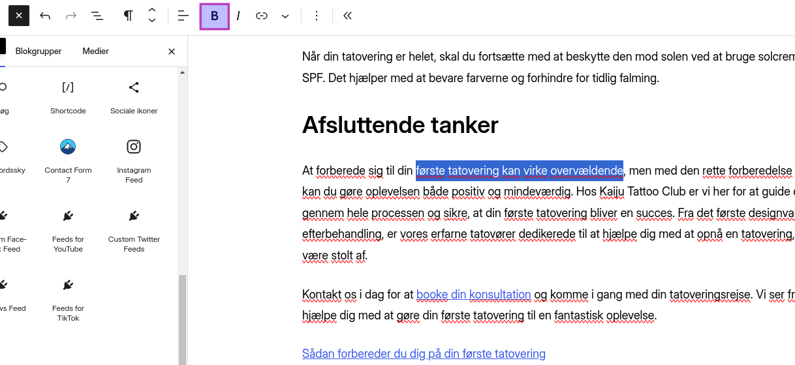

## Fed tekst
Ønsker du en fed tekst, findes der flere forskellige måder at gøre dette på.

1. [Med Gutenberg Editor](#med-wordpress-gutenberg-editor)
2. [Med genvejstaster](#med-genvejstaster)
3. [Med Markdown](#med-markdown)
4. [Med HTML tags](#med-html-og-css-tags)

### Med Wordpress' Gutenberg Editor
Hvis ikke du føler dig nok som en _hacker_ til at huske og skrive markdown eller HTML, kan du gøre de samme ting direkte i Wordpress's egen indlægseditor Gutenberg.

#### Marker teksten du ønsker at formatere
For at gøre tekst fed med Gutenberg editor, skal du markere teksten, og klikke på fed-knappen i værktøjslinjen.
1. Med din mus markerer du først ordet eller sætningen du ønsker at gøre **fed**.
2. Klik på **B** knappen i værktøjslinjen for at gøre teksten **fed**



### Med genvejstaster
For at minimere brugen af din mus, kan du også efter at have markeret teksten du ønsker at formattere, bruge genvejstasterne **CTRL + B** for at gøre teksten **fed**.

### Med markdown syntax
Du kan direkte imens du indtaster din tekst indikere at en tekst skal være **fed tekst**, ved at omringe teksten med ****** eller **__**

```md
**Denne tekst vil blive fed**
__Denne tekst vil også blive fed__
Denne tekst vil være almindelig tyndfed
```
##### Resultat
**Denne tekst vil blive fed**  
__Denne tekst vil også blive fed__  
Denne tekst vil være almindelig tyndfed  

### Med HTML (og CSS) tags
Okay, vi er lidt tilbage i hacker-land igen, men en tredje måde at gøre din tekst fed på, er ved brug af **HTML-tags**. 

Her er der endda flere måder igen, at gribe det an på - **`<strong>`**, **`<b>`** og **`<span>`** med **`style="font-weight: bold;"`**. 

```html
<b>Denne tekst vil blive fed</b>
<strong>Denne tekst vil også blive fed</strong>
<span style="font-weight: bold;">Denne tekst vil også blive fed</span>
Denne tekst vil være almindelig tyndfed
```
##### Resultat
<strong>Denne tekst vil blive fed</strong><br />
<strong>Denne tekst vil også blive fed</strong><br />
<strong>Denne tekst vil også blive fed</strong><br />
Denne tekst vil være almindelig tyndfed
