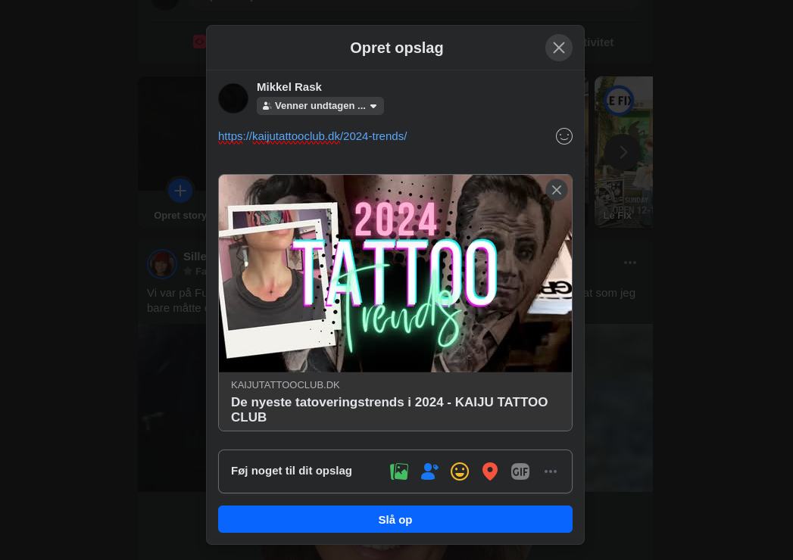

## Udvalgt billede
**Udvalgt billede** er det billede der bliver vist, når man fx deler sit indlæg fx på **Facebook, i messenger, WhatsApp, Twitter/X** o.l. 

Det er også billedet der bliver vist i **[blog](https://kaijutattooclub.dk/blog)-oversigten**, og i **toppen af hvert individuelt indlæg**.  

### Tilføj udvalgt billede
For at tilføje et **udvalgt billede** til dit indlæg, går du til **[Alle Indlæg](https://kaijutattooclub.dk/wp-admin/edit.php)**, åbner dit indlæg og klikker du på **Vælg udvalgt billede**, i **Indlæg**-fanen

### Dimensioner for udvalgt billede
For at dit billede egner sig bedst som udvalgt billede skal det gerne have et **16/9 størrelsesforhold** - fx **1920×1080px** 

Det er af hensyn til at det ikke bliver beskåret uhensigtsmæssigt, når det deles på fx. Facebook eller twitter, der altid viser billedet i præcist det størrelsesforhold. 

Det må meget gerne også indeholde noget grafik der underbygger titlen eller tekst der gentager indlæggets titel.

### Safe area
Dog skal man have _in mente_ at på [kaijutattooclub.dk](http://kaijutattooclub.dk) vises det i en lavere endnu udgave - der vises det i **21/9 bredde/højde forhold** - dvs. at dit **vigtigste** indhold af dit **udvalgt billede**, _skal_ være synligt i et 21/9 område i midten af dit **16/9 størrelsesforhold billede**.

Klik her for at downloade [eksempelfilen](https://files.gitbook.com/v0/b/gitbook-x-prod.appspot.com/o/spaces%2FWXKhAtvPVaNwhFvTnnQ8%2Fuploads%2F3WKlqL0wbMgwdJOBoVkh%2FBlog%20Indl%C3%A6g%20Safe%20Area.png?alt=media&token=f327538a-146a-4dad-8348-36d625d1dad9), med de optimale dimensioner. Den er lavet transparent, så du kan tilføje den som et ekstra lag i dit redigeringsprogram, og blot skjule det, før eksport.
### Upload dit udvalgte billede
Når du har lavet dit Udvalgte billede, uploader du det, klik på det, og indsæt det efterfølgende med **Vælg udvalgt billede** nederst til højre. 

