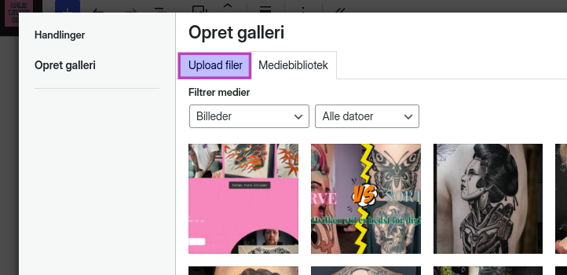
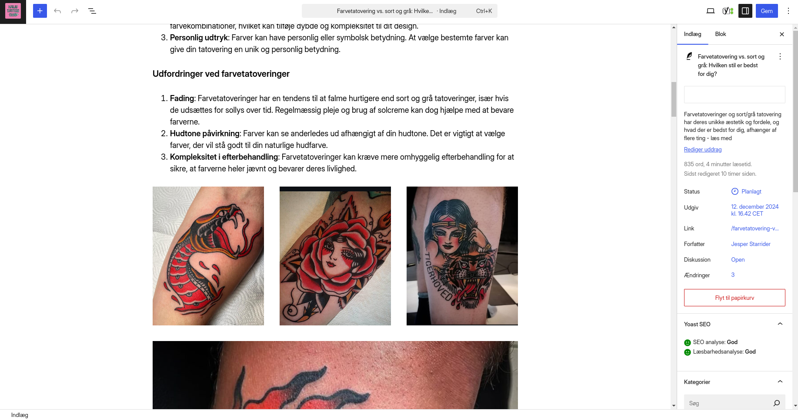

## Indsæt billede eller galleri på dit blogindlæg eller side
Klik på **Tryk / for at vælge en blok** i et blog-indlæg eller på en side, og vælger enten **/billede** eller **/galleri**, vil du efterfølgende bedt om at vælge imellem at **Upload** eller vælge et billede fra dit **Mediebibliotek**.  

### Mediebibliotek
Har du tidligere uploadet billedet, kan du genbruge det samme billede, ved at klikke på **Mediebibliotek** og vælge det fra oversigtsbilledet. Hvis du har givet billedet en titel eller beskrivelse, kan du bruge søgefeltet i top højre hjørne til at indsnævre overbliksbilledet.  

- Find det ønskede billede/de ønskede billeder  

##### NOTE Når du bruger galleri
- Marker flere billeder ved at holde **Ctrl** nede og klikke på de billeder du vil tilføje
- Marker en række billeder ved at klikke på det første billede, holde **Shift** nede og klikke på det sidste billede i rækken
- Du kan stadig uplade yderligere billeder, selvom du valgte **Mediebibliotek** - klik blog på fanen **Upload** øverst i pop-op vinduet

### Indsæt dit billede/galleri
Indsæt nu billedet eller galleriet ved at klikke på **Vælg**-knappen nederst til højre.

Du vil nu kunne se dit valgte billede eller galleri i din blog-indlæg eller side.  

## Upload enkelt billede
Er det første gang du uploader billedet, kan du gøre det ved at klikke på **Upload**-knappen, og vælge billedet fra din computer.  

Du kan også _trække-og-slippe_ billedet fra din computer og ind i feltet, for at uploade det.  

Tip: Du kan uploade dine billeder på forhånd via **Medier -> Bibliotek**[^](https://kaijutattooclub.dk/wp-admin/upload.php), hvor du også kan _trække-og-slippe_ billeder fra din computer. Det er en god idé at uploade der, og tilføje billedebeskrivelser, alt titler o.l., før du skal bruge dem i dit indlæg. Det gør dem også nemmere at finde igen på et senere tidspunkt

