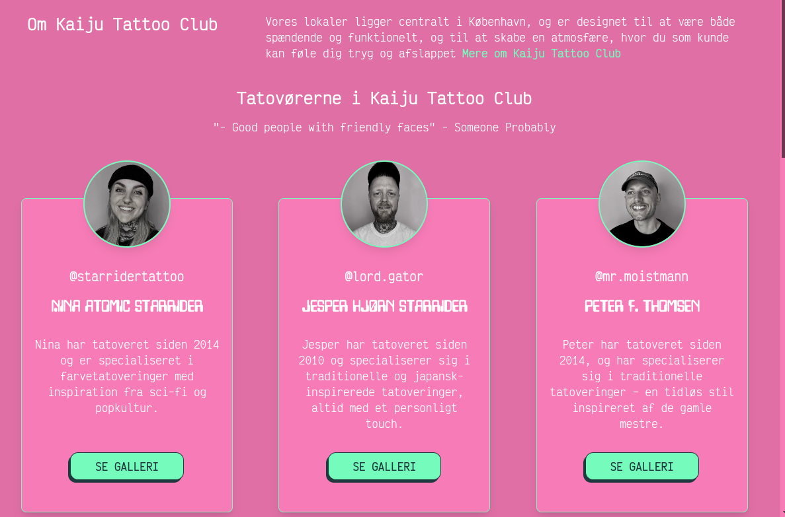

# Hvad er en "Tatovør"?
Ift hjemmesiden, er en **tatovør** en person der er del af Kaiju teamet, og har en **profil** på hjemmesiden. 

På forsiden har vi vist aktive tatovører vist i **Om Kaiju Tattoo Club** sektionen, ligesom de er vist på **[Om Os](https://kaijutattooclub.dk/om-kaiju-tattoo-club)**-siden og har hver sin egen **underside** med instagram galleri og muligheder for at tilføje ekstra gallerier eks. til **Wanna-do's**, **Flashs** til næste event og meget mere.

## Custom tattoo artist 😎
Med andre ord, er det en nem måde at tilføje og håndtere information om den enkelte ansatte/tilknyttede tatovør.

Uden at det skal blive for teknisk, er en **Wordpress Tatovør** en special lavet **post-type** ligesom et blogindlæg er en **post-type** - men i stedet for at have en **indlægs-titel** og almindeligt tekstindhold, har **tatovør-post-typen** passende felter til fx **fornavn**, **favorit-stilarter**, **Instagram brugernavn**, **e-mail** osv - og med nem mulighed for at selv tilføje flere "bokse" til informationer.

## Hvor ska' vi hen, du?
- Opret en ny tatovør  
- Rediger en eksisterende tatovør 
  - Rediger tatovør profil-billede
  - Tilføj unikt galleri til tatovør
  - Rediger instagram link til tatovør
- Slet en tatovør  
Yderligere påkrævet for at oprette en ny tatovør
- Opret en tativær-kontaktform
- Opret et instagram feed

**Gæstetatovør**
- Tilføj gæstetatovør
- Ændrer en eksisterende tatovør til gæstetatovør
